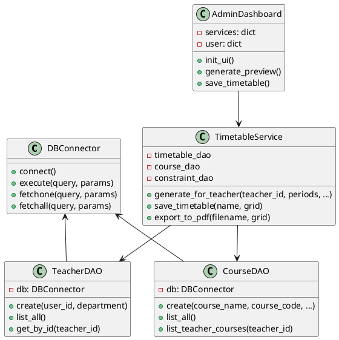
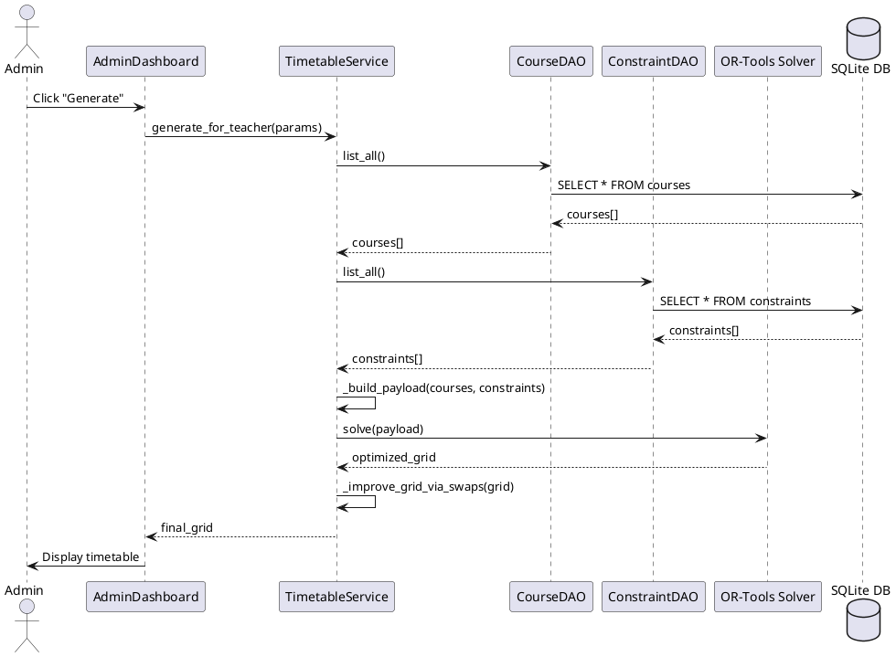
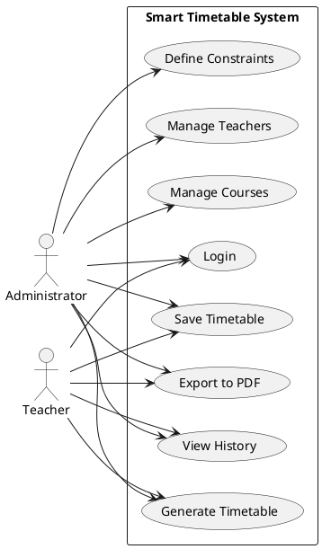

# 🎓 Smart Timetable Optimizer

> An intelligent desktop application for automated timetable generation with constraint-based optimization, built with PyQt5 and OR-Tools.

[](https://www.python.org/downloads/)
[](https://www.riverbankcomputing.com/software/pyqt/)
[](LICENSE)

---

## 📋 Table of Contents

- [Overview](#overview)
- [Features](#features)
- [System Architecture](#system-architecture)
- [Technology Stack](#technology-stack)
- [Installation](#installation)
- [Usage](#usage)
- [Project Structure](#project-structure)
- [Software Development Methodology](#software-development-methodology)
- [Database Schema](#database-schema)
- [Algorithm & Optimization](#algorithm--optimization)
- [Screenshots](#screenshots)
- [UML Diagrams](#uml-diagrams)
- [Contributing](#contributing)
- [License](#license)

---

## 🎯 Overview

**Smart Timetable Optimizer** is a comprehensive desktop application designed to automate the complex task of academic timetable generation. The system uses constraint programming and optimization algorithms to generate conflict-free timetables while respecting hard and soft constraints.

### Key Capabilities

- **Automated Scheduling**: Generate optimal timetables using OR-Tools CP-SAT solver
- **Constraint Management**: Support for hard and soft constraints (time slots, teacher availability, course requirements)
- **Multi-User System**: Separate dashboards for administrators and teachers
- **Real-time Validation**: Instant validation of timetable constraints
- **Export Functionality**: PDF export for generated timetables
- **History Tracking**: Save and retrieve previously generated timetables

---

## ✨ Features

### For Administrators

- **Teacher Management**
  - Create, edit, and delete teacher profiles
  - Assign departments and contact information
  - User credential management

- **Course Management**
  - Add courses with codes, credits, and sections
  - Assign teachers to courses
  - Manage multiple sections per course

- **Constraint Definition**
  - Define global constraints (hard/soft)
  - Specify period ranges and day restrictions
  - Course-specific and section-specific constraints

- **Timetable Generation**
  - Configure periods per day and lunch breaks
  - Set time limits for solver execution
  - Real-time generation with cancellation support
  - Edit generated timetables manually

- **Export & Save**
  - Save timetables with custom names
  - Export to PDF format
  - Historical timetable management

### For Teachers

- **Personal Course Management**
  - Create teacher-scoped courses
  - Publish courses for admin visibility
  - Define personal constraints

- **Custom Timetable Generation**
  - Generate timetables from personal courses
  - Include or exclude admin courses
  - Apply personal and global constraints

- **History & Export**
  - View previously generated timetables
  - Export personal timetables to PDF

---

## 🏗️ System Architecture

The application follows a **3-tier architecture** pattern:

```
┌─────────────────────────────────────────────┐
│         Presentation Layer (UI)             │
│  ┌─────────────┐         ┌──────────────┐  │
│  │   Login     │         │  Dashboards  │  │
│  │   Window    │────────▶│ Admin/Teacher│  │
│  └─────────────┘         └──────────────┘  │
└─────────────────────────────────────────────┘
                   │
                   ▼
┌─────────────────────────────────────────────┐
│       Business Logic Layer (SERVICE)        │
│  ┌──────────┐  ┌──────────┐  ┌──────────┐  │
│  │  Auth    │  │ Teacher  │  │ Course   │  │
│  │ Service  │  │ Service  │  │ Service  │  │
│  └──────────┘  └──────────┘  └──────────┘  │
│  ┌──────────┐  ┌────────────────────────┐  │
│  │Constraint│  │   Timetable Service    │  │
│  │ Service  │  │  (OR-Tools Solver)     │  │
│  └──────────┘  └────────────────────────┘  │
└─────────────────────────────────────────────┘
                   │
                   ▼
┌─────────────────────────────────────────────┐
│      Data Access Layer (DAL)                │
│  ┌──────────┐  ┌──────────┐  ┌──────────┐  │
│  │ Teacher  │  │  Course  │  │Constraint│  │
│  │   DAO    │  │   DAO    │  │   DAO    │  │
│  └──────────┘  └──────────┘  └──────────┘  │
│  ┌──────────┐  ┌────────────────────────┐  │
│  │Timetable │  │    DB Connector        │  │
│  │   DAO    │  │  (SQLite/MySQL)        │  │
│  └──────────┘  └────────────────────────┘  │
└─────────────────────────────────────────────┘
                   │
                   ▼
┌─────────────────────────────────────────────┐
│          Database (SQLite/MySQL)            │
└─────────────────────────────────────────────┘
```

### Design Patterns Used

1. **MVC (Model-View-Controller)**: Separation of UI, business logic, and data
2. **DAO (Data Access Object)**: Abstraction layer for database operations
3. **Service Layer**: Encapsulation of business logic
4. **Singleton**: Database connector instance
5. **Observer**: Qt signals/slots for event handling

---

## 🛠️ Technology Stack

### Core Technologies

| Component | Technology | Version | Purpose |
|-----------|-----------|---------|---------|
| **Language** | Python | 3.8+ | Core development language |
| **GUI Framework** | PyQt5 | 5.15+ | Desktop user interface |
| **Database** | SQLite / MySQL | - | Data persistence |
| **Optimization** | OR-Tools | Latest | Constraint programming solver |
| **PDF Generation** | ReportLab | 3.6.0+ | Timetable export |
| **Password Security** | bcrypt | Latest | Password hashing |

### Development Tools

- **Version Control**: Git
- **Database Management**: SQLite CLI / MySQL Workbench
- **Packaging**: PyInstaller (for standalone executable)

---

## 📦 Installation

### Prerequisites

- Python 3.8 or higher
- pip (Python package manager)
- Git

### Step 1: Clone the Repository

```bash
git clone https://github.com/SaiVardhanKallempudi/Smart_Timetable_Optimizer.git
cd Smart_Timetable_Optimizer
```

### Step 2: Create Virtual Environment

```bash
# Windows
python -m venv .venv
.venv\Scripts\activate

# Linux/Mac
python3 -m venv .venv
source .venv/bin/activate
```

### Step 3: Install Dependencies

```bash
pip install -r requirements.txt
```

**Requirements:**
```
bcrypt
PyQt5
reportlab>=3.6.0
ortools
```

### Step 4: Initialize Database

```bash
python init_db.py
```

This will:
- Create the SQLite database (`smart_timetable.db`)
- Set up all required tables
- Create default admin user (username: `admin`, password: `admin123`)

### Step 5: Run the Application

```bash
python main.py
```

---

## 🚀 Usage

### First Login

1. Launch the application: `python main.py`
2. Login with default credentials:
   - **Username**: `admin`
   - **Password**: `admin123`
3. Change the default password immediately

### Creating Your First Timetable

#### As Administrator:

1. **Add Teachers**
   - Navigate to "Teacher Management" tab
   - Click "Create Teacher"
   - Fill in details (username, full name, department, etc.)

2. **Add Courses**
   - Go to "Course Management" section
   - Enter course details: name, code, credits, section
   - Assign a teacher (optional)
   - Click "Add Course"

3. **Define Constraints**
   - In "Constraints" section, add rules:
     - Format: `CourseName,Section,Day,P1-P3` (range)
     - Or: `CourseName,Day,P2` (exact period)
     - Mark as "Hard" (must satisfy) or "Soft" (prefer)

4. **Generate Timetable**
   - Go to "Timetable Generator" tab
   - Configure:
     - Periods per day (default: 6)
     - Lunch period (optional)
     - Time limit (seconds)
   - Click "Generate"
   - Review and edit if needed

5. **Save & Export**
   - Click "Save Timetable" to store
   - Click "Export PDF" to download

#### As Teacher:

1. **Add Personal Courses**
   - Courses tab → Add courses specific to you
   - Mark as "Published" to share with admin

2. **Set Constraints**
   - Define your availability constraints
   - Set hard constraints (unavailable times)

3. **Generate**
   - Configure generation settings
   - Choose to include admin courses or not
   - Generate and save

---

## 📁 Project Structure

```
Smart_Timetable_Optimizer/
│
├── main.py                      # Application entry point
├── config.py                    # Configuration (DB settings)
├── requirements.txt             # Python dependencies
├── init_db.py                   # Database initialization script
├── create_sqlite_schema.sql     # SQL schema definition
├── migrate_add_grid.py          # Database migration script
│
├── DAL/                         # Data Access Layer
│   ├── db_connector.py          # Database connection handler
│   ├── teacher_dao.py           # Teacher CRUD operations
│   ├── course_dao.py            # Course CRUD operations
│   ├── constraints_dao.py       # Constraint CRUD operations
│   └── timetable_dao.py         # Timetable CRUD & history
│
├── SERVICE/                     # Business Logic Layer
│   ├── auth_service.py          # Authentication & user management
│   ├── teacher_service.py       # Teacher business logic
│   ├── course_service.py        # Course business logic
│   ├── constraints_service.py   # Constraint management
│   └── timetable_service.py     # Timetable generation & optimization
│
├── UI/                          # User Interface Layer
│   ├── login_window.py          # Login interface
│   ├── admin_dashboard.py       # Admin dashboard (main UI)
│   ├── teacher_dashboard.py     # Teacher dashboard
│   └── get_data_path.py         # Resource path helper
│
├── tools/                       # Utility Scripts
│   └── solver_runner.py         # OR-Tools solver integration
│
├── scripts/                     # Additional scripts
│
└── .gitignore                   # Git ignore rules
```

### Module Descriptions

#### **DAL (Data Access Layer)**

- `db_connector.py`: Handles SQLite/MySQL connections, provides unified query interface
- `*_dao.py`: Data access objects for each entity (CRUD operations)

#### **SERVICE (Business Logic)**

- `auth_service.py`: User authentication, password hashing with bcrypt
- `timetable_service.py`: Core timetable generation logic, integrates OR-Tools solver
- Other services: Validation and business rules for respective domains

#### **UI (Presentation Layer)**

- `login_window.py`: Modern login interface with password toggle
- `admin_dashboard.py`: Full-featured admin interface (700+ lines)
- `teacher_dashboard.py`: Teacher-specific interface with scoped features

#### **tools/**

- `solver_runner.py`: OR-Tools CP-SAT solver wrapper, constraint encoding

---

## 💾 Database Schema

### Entity Relationship Overview

```
users (1) ──────── (1) teachers
                        │
                        │ (1:N)
                        ▼
courses ◀───────── teacher_courses
   │
   │ (1:N)
   ▼
constraints / teacher_constraints
   │
   │ (used by)
   ▼
timetable / timetable_sets
```

### Core Tables

#### **users**
```sql
- id (PK)
- username (UNIQUE)
- password_hash
- role (Admin/Teacher)
- full_name
- email, phone
- created_at
```

#### **teachers**
```sql
- id (PK)
- user_id (FK → users.id)
- department
```

#### **courses** (Admin/Global)
```sql
- id (PK)
- course_name
- course_code (UNIQUE)
- credits
- section
- teacher_id (FK → teachers.id)
```

#### **teacher_courses** (Teacher-Scoped)
```sql
- id (PK)
- course_name, course_code
- credits, section
- teacher_id
- published (0/1)
- created_at
```

#### **constraints** (Global)
```sql
- id (PK)
- course_name, section
- day, period_range
- type (Hard/Soft)
- description
- owner_type, owner_id
- published
```

#### **teacher_constraints** (Teacher-Scoped)
```sql
- id (PK)
- course_name, section
- day, period_range
- type, description
- teacher_id
- published
- created_at
```

#### **timetable_sets** (History)
```sql
- id (PK)
- name
- created_by
- created_at
- grid (JSON)
```

---

## 🧮 Algorithm & Optimization

### Constraint Programming with OR-Tools

The application uses **Google OR-Tools CP-SAT solver** for timetable optimization.

#### Constraint Types

1. **Hard Constraints** (Must be satisfied)
   - No teacher in two places at once
   - Course-specific time restrictions
   - Lunch period blocking
   - Period range enforcement (e.g., "Math must be P1-P3 on Monday")

2. **Soft Constraints** (Preferred)
   - Teacher preferences
   - Even distribution of courses
   - Diversity maximization

#### Solver Process

```python
# Simplified flow from SERVICE/timetable_service.py

1. Load courses and constraints from database
2. Build solver payload:
   - Map courses to variables (day, period slots)
   - Encode constraints as CP-SAT constraints
3. Define objective function:
   - Maximize slot usage
   - Optimize for diversity (via swap optimization)
4. Solve with time limit (default: 20s)
5. Post-processing:
   - Validate solution
   - Apply local search improvements (swap optimization)
   - Check constraint violations
6. Return optimized grid
```

#### Diversity Optimization

Post-solver, the system applies a **local search algorithm** to improve timetable diversity:

```python
# From teacher_dashboard.py / admin_dashboard.py

def _improve_grid_via_swaps(grid, max_iters=500):
    """
    Swap courses between slots to maximize diversity score
    while maintaining constraint satisfaction
    """
    # Iteratively swap pairs of slots
    # Accept swap if it improves diversity and doesn't violate constraints
    # Score based on: variety per day, reduced consecutive repetitions
```

---

## 📊 Software Development Methodology

### Development Approach

- **Agile-inspired**: Iterative development with incremental features
- **Modular Design**: Clear separation of concerns (DAL, SERVICE, UI)
- **Test-Driven**: Unit tests for critical components (e.g., `test_authworker.py`)

### Quality Assurance

1. **Input Validation**: All user inputs validated before processing
2. **Error Handling**: Try-catch blocks with logging throughout
3. **Logging**: Comprehensive logging for debugging (`logging` module)
4. **Thread Safety**: Background workers for CPU-intensive tasks (solver execution)

### Version Control Strategy

```bash
# Branching strategy
main          # Production-ready code
├── develop   # Integration branch
├── feature/* # Feature development
└── hotfix/*  # Emergency fixes
```

---

## 📸 Screenshots

> **Note**: Add your screenshots here after generating them

```markdown
### Login Screen


### Admin Dashboard


### Teacher Dashboard


### Timetable Generation

```

---

## 🎨 UML Diagrams

### Class Diagram

> **Tip**: You can create UML diagrams using tools like:
> - **PlantUML** (text-based)
> - **draw.io** (visual)
> - **Lucidchart** (online)

**Example PlantUML for main classes:**



### Sequence Diagram: Timetable Generation



### Use Case Diagram



---

## 🤝 Contributing

Contributions are welcome! Please follow these guidelines:

### How to Contribute

1. **Fork** the repository
2. **Create** a feature branch
   ```bash
   git checkout -b feature/YourFeatureName
   ```
3. **Commit** your changes
   ```bash
   git commit -m "Add: YourFeatureName description"
   ```
4. **Push** to your fork
   ```bash
   git push origin feature/YourFeatureName
   ```
5. **Open** a Pull Request

### Code Style

- Follow **PEP 8** Python style guidelines
- Use meaningful variable/function names
- Add docstrings to all functions/classes
- Comment complex logic

### Testing

- Add unit tests for new features
- Ensure existing tests pass before submitting PR
- Run `python -m pytest` (if pytest configured)

---

## 📄 License

This project is licensed under the **MIT License**.

```
MIT License

Copyright (c) 2025 Sai Vardhan Kallempudi

Permission is hereby granted, free of charge, to any person obtaining a copy
of this software and associated documentation files (the "Software"), to deal
in the Software without restriction...
```

See [LICENSE](LICENSE) file for full details.

---

## 👤 Author

**Sai Vardhan Kallempudi**

- GitHub: [@SaiVardhanKallempudi](https://github.com/SaiVardhanKallempudi)
- Project Link: [Smart_Timetable_Optimizer](https://github.com/SaiVardhanKallempudi/Smart_Timetable_Optimizer)

---

## 🙏 Acknowledgments

- **Google OR-Tools**: For the powerful CP-SAT constraint solver
- **PyQt5**: For the robust GUI framework
- **ReportLab**: For PDF generation capabilities
- **bcrypt**: For secure password hashing

---

## 📚 Additional Resources

### Documentation

- [OR-Tools Documentation](https://developers.google.com/optimization)
- [PyQt5 Documentation](https://www.riverbankcomputing.com/static/Docs/PyQt5/)
- [SQLite Documentation](https://www.sqlite.org/docs.html)

### Tutorials

- [Constraint Programming Guide](https://developers.google.com/optimization/cp)
- [PyQt5 Tutorial](https://www.pythonguis.com/tutorials/pyqt-basic-widgets/)

---

## 🔮 Future Enhancements

- [ ] **Multi-section support**: Generate timetables for multiple sections simultaneously
- [ ] **Room allocation**: Add classroom/resource constraints
- [ ] **Web interface**: Flask/Django web version
- [ ] **Mobile app**: React Native companion app
- [ ] **AI suggestions**: ML-based constraint suggestion
- [ ] **Import/Export**: Excel import for bulk course/constraint upload
- [ ] **Visualization**: Gantt charts, heatmaps for timetable analysis
- [ ] **Notifications**: Email alerts for timetable updates
- [ ] **Multi-language**: Internationalization support

---

## ⚠️ Troubleshooting

### Common Issues

**1. Database Connection Error**
```bash
# Solution: Re-initialize database
python init_db.py
```

**2. Import Error: No module named 'ortools'**
```bash
# Solution: Install missing dependency
pip install ortools
```

**3. PyQt5 Application Won't Start**
```bash
# Solution: Reinstall PyQt5
pip uninstall PyQt5
pip install PyQt5
```

**4. Solver Takes Too Long**
- Reduce time limit in configuration
- Simplify constraints
- Reduce number of courses

---

## 📞 Support

For issues, questions, or suggestions:

1. **GitHub Issues**: [Open an issue](https://github.com/SaiVardhanKallempudi/Smart_Timetable_Optimizer/issues)
2. **Email**: [Your email if you want to provide]
3. **Discussions**: Use GitHub Discussions for general questions

---

<div align="center">

**⭐ If you find this project useful, please consider giving it a star! ⭐**

Made with ❤️ by Sai Vardhan Kallempudi

</div>